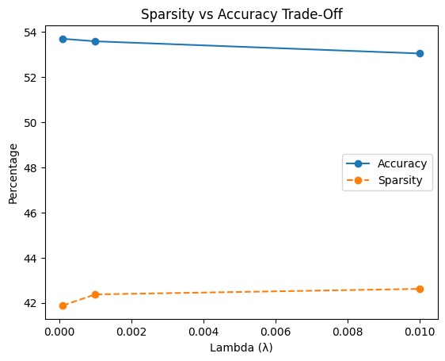
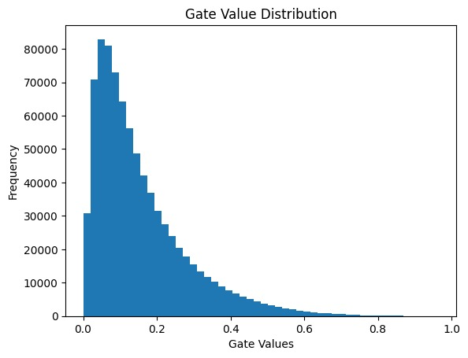

# Self-Pruning Neural Network

This project implements a self-pruning neural network using PyTorch.

## Key Idea
- Each weight has a learnable gate parameter
- Gates are passed through sigmoid
- Model learns to remove unnecessary weights during training

## Results
- Accuracy ~53%
- Sparsity ~42%

## Files
- Notebook: self_pruning_network_iniya.py
- Results: stored in results folder

## Output Graphs

### Sparsity vs Accuracy

### Gate Value Distribution

## Author
Iniya Venkatesan
